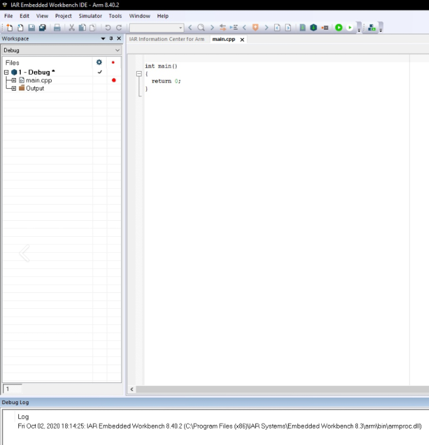
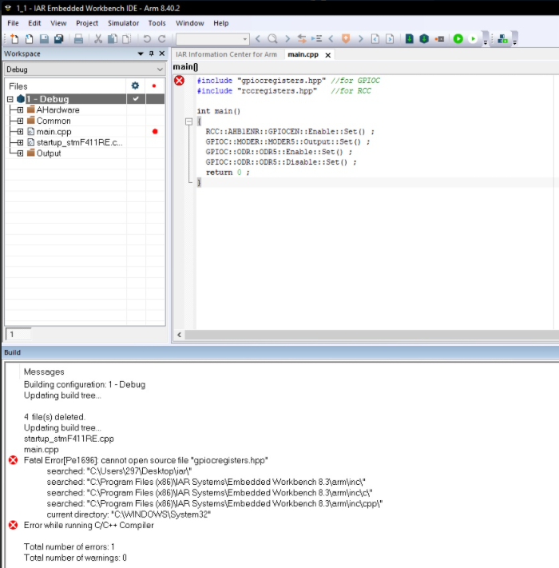
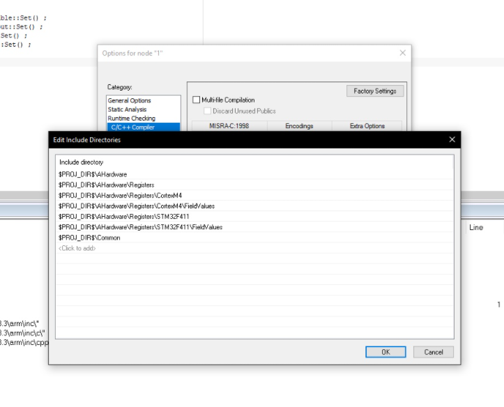
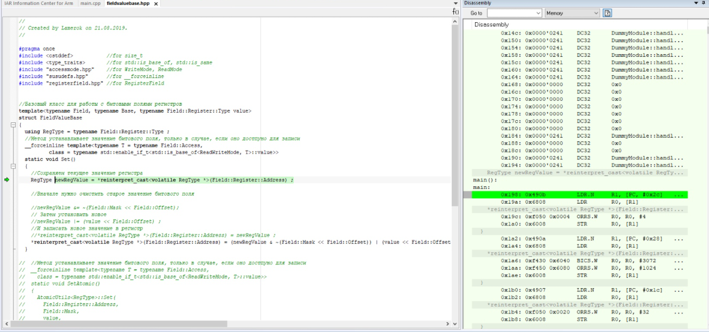
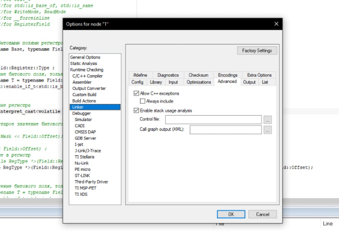
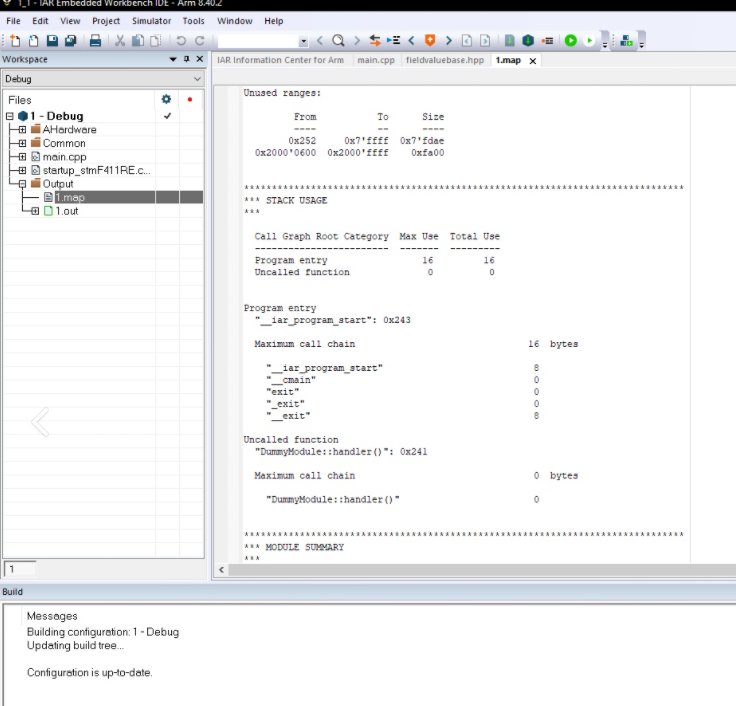
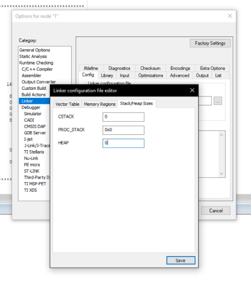
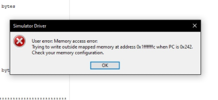

=== Лабораторная работа №1
1) Создаем проект C++ c main.cpp

.Созданный проект С++

Затем подключаем к проекту файл cstartup.cpp и создаем структуру проекта в соответсвие со структурой папок. Изменяем значения STACK и HEAP с 0x2000 на 0x1000.

Записываем программу преподавателя в main.cpp.

.Код программы выданный преподавателем

Программа выдает ошибку, что компилятор не может найти путь до файла. Её мы устраняем путём указания директории в Options → C/C++ Compiler → Preprocessor и выбираем нужную директорию.

.Устранение ошибки

2) После устранения ошибок начинаем выполнять отладку на компьютере в симуляторе. Для отладки существует горачая клавиша F5.

.Отладка программы

Чтобы включить анализатор стека, нужно зайти в Options - Linker - Advanced…​ и поставить галочку напротив Enable stack usage analysis

.Запуск анализатора стека

3) Запускаем анализатор стека и открываем файл map, который показывает,что при максимальной нагрузке размер стека может быть 16 байт.

.Анализ стека

Ставим настройки STACK и HEAP в ноль.

.Настраивание STACK и HEAP в ноль.

Программма выдает ошибку.

.Полученная ошибка

Если мы собираемся выделять динамическую память только средствами ОС,то можно поставить в настройках линкера размер HEAR = 0.
Со стеком немного сложнее. Есть стек, память под который выделяется линкером. Его отключать нельзя, иначе не сможет работать ОС.
STACK — это область оперативной памяти, которая создаётся для каждого потока. Он работает в порядке LIFO (Last In, First Out),  то есть последний добавленный в стек кусок памяти будет первым в очереди на вывод из стека. Каждый раз, когда функция объявляет новую переменную, она добавляется в стек, а когда эта переменная пропадает из области видимости (например, когда функция заканчивается), она автоматически удаляется из стека.

=== Вопросы по разделу
1) Интегрированная среда разработки  — комплекс программных средств, используемый программистами для разработки программного обеспечения.

2) Компилятор – это транслятор, который осуществляет перевод исходной программы в эквивалентную ей объектную программу на языке машинных команд или языке ассемблера. Таким образом, компилятор отличается от транслятора тем, что его результирующая программа написана обязательно на языке машинных команд.

3) Компоновщик  предназначен для связывания между собой объектных файлов, порождаемых компилятором, а также файлов библиотек, входящих в состав системы программирования. Результатом его работы является единый файл, называемый, загрузочным модулем

4) Проектирование программного обеспечения — процесс создания проекта программного обеспечения (ПО), а также дисциплина, изучающая методы проектирования. Проектирование ПО является частным случаем проектирования продуктов и процессов.

Основные задачи, входящие в процесс проектирования ПО:

- выбор метода и стратегии решения;
- выбор представления внутренних данных;
- разработка основного алгоритма;
- документирование ПО;
- тестирование и подбор тестов;
- выбор представления входных данных.

5) Получение требования на проект - Анализ - Degish - Develop - Debug - Тестрирование ПО - Использование

6) Отладка нужна для того, чтобы понять на каком этапе программирования произошла ошибка, так как можно запустить программу до точки отладки, а не всю целиком.

На практике точка останова определяется как одно или несколько условий, при которых происходит прерывание программы. Наиболее часто используется условие останова при переходе управления к указанной инструкции программы. Другое условие останова — операция чтения, записи или изменения указанной ячейки или диапазона ячеек памяти.

7)

- мониторинг состояния процессора
- большая база пользователей и документации
- удобство использования нескольких конфигураций
- совместимость со многими микроконтроллерами
